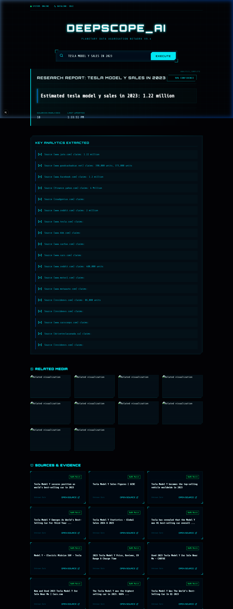
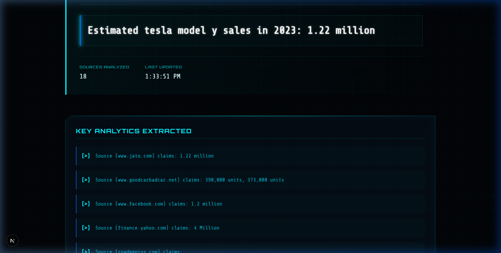
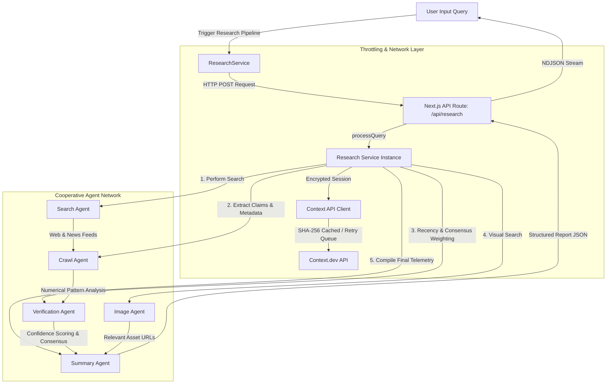

# DeepScope AI
> **Planetary Data Aggregation Network v9.4**

DeepScope AI is a production-grade, highly specialized multi-agent research and data aggregation system built on Next.js 16 and TypeScript. It utilizes advanced orchestrating agents to query, extract, verify, and summarize complex real-time search queries into cohesive analytics reports.

---

## 📸 Interface Gallery

Here is the cybernetic HUD interface designed to monitor real-time uplink status and view report metrics.

### 🖥️ Dashboard Overview


### 📊 Source Analysis Panel


---

## 🛠️ System Architecture

DeepScope AI is built as a pipeline of cooperative agents, governed by a caching client and concurrency throttling mechanism.



### Agent Directory & Roles

1. **Search Agent (`SearchAgent`)**:
   - Executes search operations across `web` and `news` indexes in parallel using the `context.dev` network.
   - Automatically deduplicates incoming search results based on canonical URLs.

2. **Crawl Agent (`CrawlAgent`)**:
   - Extracts relevant statistics, numeric insights, and facts from metadata, snippets, and page contents.
   - Employs regex pattern matching specifically calibrated to isolate metrics related to millions/billions/percentages.

3. **Verification Agent (`VerificationAgent`)**:
   - Calculates a mathematically weighted confidence score (capped at 98% for realism) based on:
     - **Source Volume**: Up to 20 points based on source count.
     - **Cross-Source Agreement**: Up to 20 points for concurrent claims.
     - **Recency**: Up to 10 points if data is less than 30 days old.
   - Computes consensus across claims to determine the primary factual yield.

4. **Image Agent (`ImageAgent`)**:
   - Scrapes context-relevant images to display inside the multimedia segment of the HUD dashboard.

5. **Summary Agent (`SummaryAgent`)**:
   - Aggregates insights from all agents to produce a `ResearchReport` containing:
     - `title`, `answer`, `confidence`, `confidence_reason`, `key_statistics`, `findings`, `references`, and media content.

---

## ⚡ Performance & Reliability Core

DeepScope AI handles scale with a robust API framework situated in `src/lib/context/ContextApiClient.ts`:

- **Request Queue & Concurrency Throttle**: Restricts outbound traffic to a maximum of `5` concurrent requests, queueing extra requests automatically.
- **SHA-256 Hashing Cache**: Caches API requests locally for `15 minutes` using unique cryptographic SHA-256 hashes generated from the query body and endpoint parameters.
- **Exponential Backoff Retry**: Standardized logic to retry queries up to 3 times on `429 (Rate Limit)` or `5xx (Server Error)` with dynamic wait multipliers.
- **NDJSON Streaming**: Streams step-by-step pipeline status updates (`INITIALIZING_UPLINK`, `SEARCHING`, `COLLECTING_SOURCES`, `VERIFYING_FACTS`, etc.) to the client for immediate visual feedback.

---

## ⚙️ Configuration & Environment

Create a `.env.local` file at the root of the project:

```env
CONTEXT_API_KEY=your_context_dev_secret_key
```

---

## 🚀 Getting Started

### Prerequisites

- Node.js (v18.x or later)
- npm, yarn, or pnpm

### Installation

```bash
# Clone the repository
git clone https://github.com/your-username/deepscope-ai.git
cd deepscope-ai

# Install dependencies
npm install
```

### Available Scripts

In the project directory, you can run:

```bash
# Start development server with Turbopack (recommended)
npm run dev

# Build the production bundle
npm run build

# Start the built production server
npm run start

# Run ESLint validation
npm run lint
```

---

## 📂 Project Structure

```
deepscope-ai/
├── src/
│   ├── app/
│   │   ├── api/
│   │   │   └── research/
│   │   │       └── route.ts         # NDJSON Streaming Route
│   │   ├── globals.css              # Cybernetic CSS Base Style & Tokens
│   │   ├── layout.tsx
│   │   ├── page.tsx                 # Search Console HUD Layout
│   │   └── page.module.css
│   ├── components/
│   │   ├── ExportMenu.tsx           # Report export (JSON/CSV) panel
│   │   ├── ImageGallery.tsx         # Media display segment
│   │   ├── ResultCard.tsx           # Confidence & Primary answer display
│   │   └── SourcePanel.tsx          # Factual references dashboard
│   └── lib/
│       ├── agents/
│       │   └── ResearchService.ts   # Core Agent orchestration logic
│       └── context/
│           └── ContextApiClient.ts  # Queue, Cache, and HTTP request wrapper
```

---

## 📝 License

Distributed under the MIT License. See `LICENSE` for more information.
